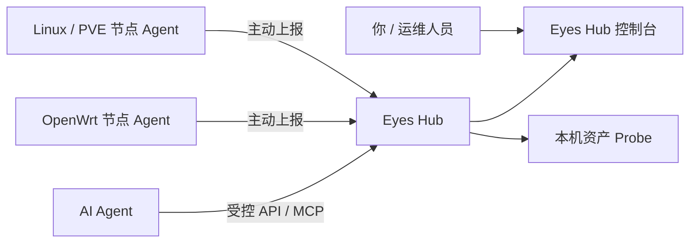

# Eyes — 看见并连接你的机器资源

Eyes 是一个面向个人机房、小团队和边缘设备的自托管控制台。它把散落在家里、办公室、云服务器、旁路由、PVE 和 NAS 上的机器整理成一个可查看、可连接的资源网络，让人和 AI Agent 都能更快理解：**有哪些节点、它们是否在线、能提供什么能力，以及哪些服务可以使用。**

项目从单机服务健康检查工具发展而来，目前已经具备 Hub 控制台、无界面 Node Agent、Fleet 资源汇总、域名探测和 AI 服务资产目录。调度、资源租约与受控执行仍在继续建设中。

## 你可以用 Eyes 做什么

- **看服务是否正常**：检查 Hub 本机可见的 Docker、Systemd、Cron、HTTP、端口、WireGuard、NAS 和资源状态。
- **管理多台机器**：Linux、OpenWrt 等节点以后台服务主动连接 Hub，无需对外开放 Agent 端口。
- **查看全网资源**：在 Fleet 页面查看节点在线状态、CPU、内存、磁盘、角色和已声明能力。
- **检查代理域名**：从网关配置发现域名，并区分可达、HTTP 异常和连接失败。
- **整理 AI 资产**：汇总 `ai-key` 与 Totemora 中的模型关系，查看脱敏后的配置和连通状态。
- **给 Agent 提供工具**：通过带 Bearer 鉴权的 MCP 入口向受信任 Agent 提供 Context7 文档查询。

登录 Hub 后，主要页面如下：

| 页面 | 地址 | 你能看到什么 |
| --- | --- | --- |
| 服务状态 | `/` | Hub 本机可见的服务、网络和资源健康状态 |
| Fleet 节点 | `/fleet` | 所有已注册节点的联通性、资源与能力 |
| 域名管理 | `/domains` | 反向代理域名及实时可达状态 |
| 资产管理 | `/assets` | 模型目录、Context7 账号状态和 Agent 接入信息 |

> “服务状态”只代表 Hub 本机的检查结果，不是整个 Fleet 的健康汇总；全网节点请以 Fleet 页面为准。详见[观测作用域与统计口径](docs/observability-scopes.md)。

## 它是怎样连接起来的



- **Hub** 保存节点目录、最新状态和资源快照，并提供 Web、API 和 MCP 入口。
- **Node Agent** 以无界面的系统服务运行，主动向 Hub 注册和上报；Hub 暂时不可用不会影响节点原有业务。
- **Asset Probe** 只在 Hub 本机读取模型和 Context7 凭据，只向页面返回脱敏状态。
- **Consumer Agent** 通过统一入口使用被授权的能力，不需要知道节点密码、SSH Key 或 Docker Socket。

## 快速启动 Hub

需要 Docker 和 Docker Compose。先复制配置并替换所有 `replace-with-*` 占位值：

```bash
cp .env.example .env

# EYES_SECRET_KEY 建议使用 32 位以上随机值
# EYES_WEB_PASSWORD 是登录控制台的密码，至少 12 位
# EYES_HUB_ENROLL_TOKEN 用于新节点首次注册，至少 24 位

mkdir -p data
if [ ! -e eyes.db ]; then
  install -m 600 /dev/null eyes.db
fi

docker compose up -d --build
docker compose ps
```

默认访问地址是：

```text
http://<Hub-IP>:8090/login
```

登录密码来自 `.env` 中的 `EYES_WEB_PASSWORD`。如果设置了其他 `EYES_PORT`，请把地址中的 `8090` 换成实际端口，例如设置 `EYES_PORT=18090` 时访问 `http://<Hub-IP>:18090/login`。

### 已有数据库升级

Compose 会把仓库根目录的 `eyes.db` 挂载为 Hub 数据库。已有数据升级前先备份；全新安装在上一步已经创建空文件，可跳过：

```bash
if [ -f eyes.db ]; then
  cp eyes.db eyes.db.pre-fleet-backup
fi
```

不要删除已有的 `eyes.db`、`data/` 或 Docker volume。

## 接入第一台节点

### Linux

在节点上运行 Agent 做一次连通验证：

```bash
python3 agent/eyes-agent.py \
  --mode node \
  --hub-url https://<Hub地址> \
  --enroll-token "$EYES_HUB_ENROLL_TOKEN" \
  --state-dir ./data/agent-state \
  --once
```

验证成功后，可执行 `sudo sh agent/install.sh` 安装 systemd 服务，再编辑 `/etc/eyes/agent.env`。首次注册会保存节点自己的 `node_id` 和凭据，以后不再需要 enrollment token。

### OpenWrt

OpenWrt 25+ 节点先安装 Python 3，再执行：

```bash
sh agent/install-openwrt.sh
```

安装器使用原生 procd 管理进程，不依赖 systemd 或 Docker。首次注册成功后，应从 `/etc/eyes/agent.env` 删除 `EYES_ENROLL_TOKEN`。

远程节点默认只向 HTTPS Hub 发送凭据。`http://127.0.0.1` 和 `http://localhost` 只适合本机开发；受控测试网络暂时没有 TLS 时，需显式添加 `--allow-insecure-http`。

接入后登录 `/fleet`：节点应先显示为 `online`，并逐步出现 Inventory、Resources 和 Capability 信息。离线节点会保留最后一次快照，但不会继续计入在线资源总量。

## 使用资产管理和 Agent MCP

进入 `/assets` 可以查看：

- `ai-key` 中已配置的模型 Provider；
- Totemora Agent 与模型的使用关系；
- 模型是否已配置、鉴权失败、额度不足或连通正常；
- Context7 账号的可用状态与上游返回的额度信息。

模型 Key、Context7 Key 和 MCP Token 不会显示在页面，也不应写入仓库。生产环境优先把它们放在权限为 `0600` 的只读 Secret 文件中。

配置 Context7 账号后，受信任 Agent 可连接：

```text
POST http://<Hub-IP>:<Hub端口>/mcp/context7
Authorization: Bearer <独立的 asset-api-token>
```

该入口提供 `resolve-library-id` 和 `query-docs`。Context7 属于可选能力：未配置账号时，Hub 和其他页面仍可正常运行；当前真实账号的最终验收由部署者填写本机 Secret 后进行。完整配置见[资产管理与 Agent 服务聚合](docs/asset-management.md)。

## 宿主机服务扫描

默认 Compose 使用项目约定的 `star` 目录布局，并挂载 Gateway 配置、NAS、`ai-key` 和 Totemora 配置。目录不同的机器应先在 `.env` 中覆盖对应的 `*_HOST` 路径。需要额外扫描宿主机 Docker 时，再检查 `docker-compose.host.example.yml` 中的示例路径，并作为 Compose override 启动：

```bash
docker compose -f docker-compose.yml -f docker-compose.host.example.yml up -d --build
```

Docker Socket 等同高权限入口，只应挂载到可信 Hub。资源、WireGuard 和网速卡片会按页面设置的周期读取最新状态；Hub 后台服务扫描默认关闭，启用 `EYES_ENABLE_SCHEDULED_CHECKS=1` 后，Docker、Systemd、Cron 等检查才会按各自周期自动执行。若宿主机已经使用 `cron_check.py` 或 `check.py --alert`，应保持该开关关闭，避免重复检查和重复告警。

## 单机命令行模式

不需要 Hub 时，仍可把 Eyes 当作轻量健康检查脚本使用：

```bash
pip install pyyaml
cp config.example.yaml config.yaml

python3 check.py              # 终端检查
python3 check.py --json       # JSON 输出
python3 check.py --watch 10   # 每 10 秒刷新
python3 check.py --quiet      # 只显示失败项
python3 check.py --alert      # 有失败才发邮件
python3 check.py --report     # 始终发邮件报告
python3 check.py --sync       # 从 Nginx 配置同步服务后检查
```

手动服务定义位于 `conf.d/`；Nginx 自动发现会生成 `_nginx_docker.yaml` 和 `_nginx_http.yaml`。命令退出码为 `0` 表示全部通过，`1` 表示至少一项失败。

## 当前边界

Eyes 已经能完成“发现、描述和观察”，但还没有把所有资源直接交给 Agent 执行：

- Workload、ResourceClaim、Lease 和命令通道目前只有控制面骨架，节点不会执行 Hub 下发的命令。
- 受控远程 shell 是规划中的独立高权限维护能力，当前版本没有新增远程 shell 入口。
- Hub 还不是通用模型代理网关；当前 MCP 只聚合 Context7 文档查询。
- 公网使用前需要 HTTPS、访问审计和更完整的节点身份机制。

准确的已实现范围与下一步计划见[实现状态](docs/implementation-status.md)和[演进路线](docs/roadmap.md)。

## 进一步阅读

- [文档导航](docs/README.md)
- [产品愿景与边界](docs/product-vision.md)
- [总体架构](docs/architecture.md)
- [安全设计](docs/security.md)
- [Hub-Agent 协议](docs/protocol.md)

## License

MIT
