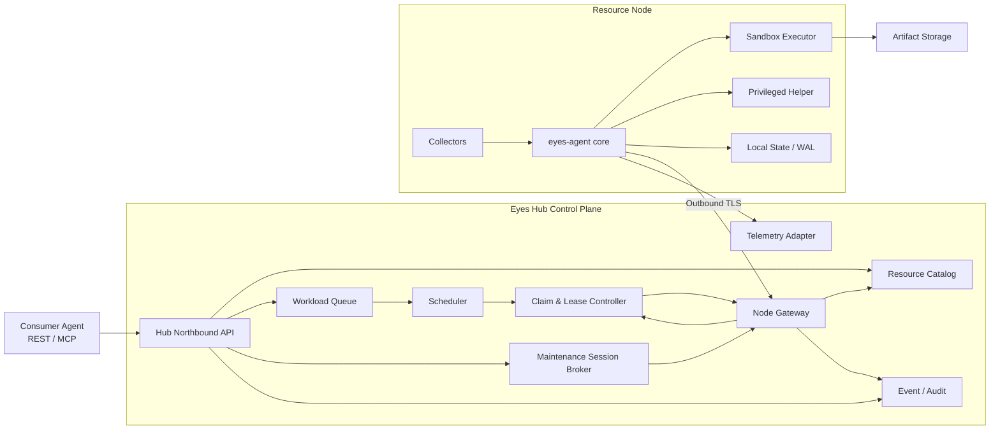

# 总体架构

## 架构概览

## 四个逻辑平面

### 控制面

由 Hub 承担：

- 节点身份和注册。
- 全局资源目录与状态版本。
- 工作负载队列和调度。
- ResourceClaim、Lease 和任务状态机。
- 策略、权限和审计。

控制消息体积小、需要强身份和幂等，但不承担大文件传输。

### 节点面

`eyes-agent` 是每台机器上的长期守护进程：

- 发现操作系统、网络、运行时、硬件、服务和数据位置。
- 维护到 Hub 的主动出站连接。
- 缓存最近一次期望状态、未发送事件和活动租约。
- 执行节点本地策略并保护系统保留资源。

Hub 节点运行同一个 Agent，并以 `eyes.io/role=hub` 标识。

### 执行面

执行面只接受已经绑定的 Lease：

- MVP：OCI/Docker 容器执行器。
- 后续：现有 Ray、Nomad、Kubernetes、systemd transient unit 等适配器。
- 宿主机特权操作由独立 Helper 完成，采用固定动作白名单。

调度资源与操作系统隔离资源必须区分。逻辑上申请 `cpu=2` 不等于已经限制进程只能使用两个 CPU；执行器还需设置 cgroup、内存、PID、网络和磁盘限制。

### 数据面

大数据不经 Hub API 进程中转：

- 小型结构化结果可直接回传 Hub。
- 大型输入和制品通过对象存储、NAS、节点间直连或预签名 URL 传输。
- Hub 保存位置、摘要、大小、校验和、访问策略和生命周期。

## Hub 组件

### Node Gateway

- 注册、证书更新和心跳。
- inventory、capability、resource、service、link 上报。
- 命令长轮询及结果确认。
- 协议版本协商、限流和幂等处理。

### Resource Catalog

维护节点、能力、资源、服务、数据位置和网络连接图。Catalog 是调度事实来源，但必须标记数据的新鲜度和来源。

### Scheduler

使用 `QueueSort -> Filter -> Score -> Reserve -> Permit -> Bind` 流水线：

- `Filter` 排除离线、不可信、能力不足或资源不足的节点。
- `Score` 结合装箱密度、数据局部性、网络质量、可靠性和资源碎片。
- `Reserve` 创建短期临时预留。
- `Permit` 等待节点本地检查通过。
- `Bind` 生成正式 Lease 和 fencing token。

该分阶段模型借鉴 Kubernetes 调度框架的 Filter、Score、Reserve、Permit 和 Bind 扩展点，而不是复制 Kubernetes 实现。

### Claim & Lease Controller

- 保证同一份独占资源不会同时分配给多个工作负载。
- 处理续租、到期、节点失联、任务取消和回滚。
- 对迟到的旧执行请求使用 fencing token 拒绝。

### Northbound API

Consumer Agent 的稳定入口：

- 查询节点、能力和可用资源。
- 提交、查询、取消工作负载。
- 获取日志摘要和 Artifact 元数据。

REST 是规范事实来源；MCP Server 作为薄适配层，将以下能力暴露为工具：

- `eyes_list_resources`
- `eyes_find_placement`
- `eyes_submit_workload`
- `eyes_get_workload`
- `eyes_cancel_workload`
- `eyes_get_artifacts`
- `eyes_run_maintenance_action`
- `eyes_request_shell_session`

最后两个工具只对具有节点维护权限的身份暴露，其中 ShellSession 可以返回短期 SSH 证书/连接信息或受控 PTY 会话句柄。MCP 层不绕过 Hub 的授权、调度和审计。

### Maintenance Session Broker

维护通道与资源调度通道分离：

- 普通 Workload 权限不能打开宿主机 shell。
- 具有 `node.shell.open` 权限的操作者或自动化 Agent 可以申请短期 `ShellSession`。
- 会话绑定 actor、目标节点、用途、有效期、空闲超时、命令/提权范围和审计策略。
- 首选复用 OpenSSH 短期证书与 WireGuard/Tailscale/Headscale 网络；Hub 负责授权和签发短期凭据，不保存节点静态密码。
- 节点不可直接到达时，可由 Agent 的主动连接承载受控 PTY 数据通道，但该能力应晚于非交互维护命令实现。
- break-glass root 会话需要更高权限，可要求二次确认或人工审批，并在 UI 中显著标识。

非交互修复优先使用结构化 `MaintenanceAction`，例如重启 allowlist 内的服务、刷新包索引或修复指定配置。只有无法预先结构化的诊断与修复才进入交互 shell。

## Agent 内部结构

### Core

身份、配置、连接、状态机和插件生命周期。默认以非 root 用户运行。

### Collectors

按命名空间注册，失败彼此隔离：

- `system`: CPU、内存、磁盘、负载、温度。
- `network`: 接口、路由、DNS、WireGuard/Tailscale 状态。
- `runtime.docker`: 容器、镜像、可用执行能力。
- `service.systemd`: unit 状态。
- `device.nvidia`: GPU 型号、显存、驱动和健康。
- `data`: 本地模型、数据集和缓存索引。

### Executor

- 拉取或验证工作负载镜像。
- 按 Lease 配置资源限制和工作目录。
- 管理启动、停止、超时、重试、日志和退出状态。
- 将 Artifact 元数据和校验和上报 Hub。

### Privileged Helper

只提供有限 RPC，例如读取 WireGuard 状态、重启 allowlist 内的 systemd 服务或创建受限 cgroup。普通 Workload 和 MaintenanceAction 不能向 Helper 传任意 shell 字符串。交互式 ShellSession 由独立会话执行器处理，并通过 sudoers/polkit 再次限制是否允许提权。

## 部署形态

### 单机/小型网络

- 一个 Hub 进程或容器。
- SQLite WAL 保存控制面数据。
- 单独的 scheduler/worker 进程，避免多个 Web worker 重复执行任务。
- 系统指标可先存 SQLite 的有限保留窗口。

### 扩展形态

- PostgreSQL 保存节点、Claim、Lease、Workload 和审计。
- OpenTelemetry/VictoriaMetrics 保存高频指标。
- API 和 Node Gateway 可横向扩容。
- 达到真实消息吞吐瓶颈后再加入 NATS JetStream。

## 可借鉴的上游设计

- [Kubernetes Scheduler](https://kubernetes.io/docs/concepts/scheduling-eviction/kube-scheduler/)：Filter、Score、Reserve、Permit、Bind 调度阶段。
- [Kubernetes Dynamic Resource Allocation](https://kubernetes.io/docs/concepts/scheduling-eviction/dynamic-resource-allocation/)：DeviceClass、ResourceSlice、ResourceClaim、共享容量和设备健康。
- [Ray Resources](https://docs.ray.io/en/latest/ray-core/scheduling/resources.html)：物理资源与逻辑调度资源分离。
- [Ray Placement Groups](https://docs.ray.io/en/latest/ray-core/scheduling/placement-group.html)：多资源原子预留和 PACK/SPREAD 策略。
- [Nomad Scheduling](https://developer.hashicorp.com/nomad/docs/concepts/scheduling/how-scheduling-works)：节点过滤、评分、bin packing、affinity 和 spread。
