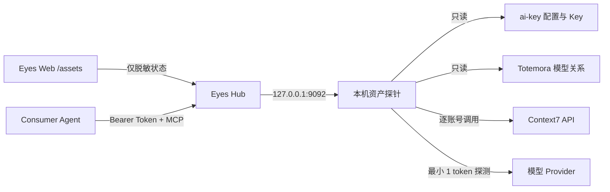

# 资产管理与 Agent 服务聚合

Eyes 的“资产管理”页面把分散的模型配置和 Context7 账号整理为可观察、可供 Agent 使用的服务资产。页面地址为 `/assets`。

## 组件与信任边界



- Web 容器不挂载 Provider Key，也不接收 Context7 Key。
- `eyes-asset-probe` 只监听 `127.0.0.1:9092`，负责读取本机凭据、执行探测和账号池选择。
- Hub 从探针取得的模型状态和账号额度都不含 Key；数据库和页面不保存 Key。
- 对外的 Context7 MCP 入口为 `/mcp/context7`，必须使用独立的 `EYES_ASSET_API_TOKEN`。
- 本机上能访问 loopback 的进程仍能调用资产探针，因此 Hub 宿主机本身属于受信任边界。

## 模型聚合

当前目录来源：

- `ai-key/providers.conf`：Provider、协议、Base URL 和模型。
- `ai-key/.env`：Provider Key，只由资产探针读取。
- Totemora `providers.yaml` 与 `agents.yaml`：模型和 Agent 使用关系。

相同 Provider/模型会合并，`qwen` 归一为 `dashscope`。只有模型 ID 完全相同时才复用 `ai-key` 的连接配置；Totemora 的 settings-file 模型不会被猜测映射到另一个 Provider 端点。使用 `api_key_env` 的 Totemora-only Provider 可通过 `EYES_TOTEMORA_ENV_FILE_HOST` 指向的只读 env 文件向资产探针注入同名变量，否则页面显示“未配置 Key”。

首次读取或手动“刷新模型”会对每个已配置模型发送一个最大输出为 1 token 的最小请求。结果缓存 5 分钟，页面刷新不会反复消耗模型额度。探测不读取或展示模型回答正文。

## Context7 账号池

多个账号使用一个环境变量配置：

```dotenv
EYES_CONTEXT7_ACCOUNTS=personal=ctx7sk_xxx,work=ctx7sk_yyy
```

每个标签和 Key 必须唯一。请求按账号轮询；遇到 `401`、`403` 或 `429` 时自动切换到下一个账号。额度重置后，账号会重新进入候选池。成功的相同文档查询缓存 6 小时，最多保存 128 项，以减少重复消耗。

页面显示 `RateLimit-Limit`、`RateLimit-Remaining` 和 `RateLimit-Reset` 响应头。Context7 官方文档说明这些头用于描述当前限额、剩余请求和 Unix 重置时间；如果某次响应没有返回它们，页面会明确显示“未知”，不会估算额度。官方的完整月度/日度使用量目前只能在 Dashboard 查看：

- [Context7 API Guide](https://context7.com/docs/api-guide)
- [Context7 Usage Dashboard](https://context7.com/docs/howto/usage)

## 部署配置

默认 Compose 假设三个项目位于同一 `star` 目录布局：

```dotenv
EYES_AI_KEY_DIR_HOST=../ai-key
EYES_TOTEMORA_CONFIG_DIR_HOST=../../app/Totemora/configs/example
EYES_TOTEMORA_ENV_FILE_HOST=/path/to/totemora-provider.env
EYES_CONTEXT7_ACCOUNTS=personal=ctx7sk_xxx,work=ctx7sk_yyy
EYES_ASSET_API_TOKEN=至少24位的独立随机Token
EYES_ASSET_MCP_RATE_LIMIT_PER_MINUTE=30
```

目录不同的机器只需覆盖前两个宿主机路径。启动后检查：

```bash
docker compose up -d --build
curl -fsS http://127.0.0.1:9092/api/health
```

不要把真实 Key 或 Token 写入仓库。`.env` 已被 Git 忽略；生产部署还可进一步切换为外部 Secret 文件或 Secret Manager。

## Agent 接入

MCP URL：

```text
http://<hub-ip>:<hub-port>/mcp/context7
```

客户端需发送：

```text
Authorization: Bearer <EYES_ASSET_API_TOKEN>
```

MCP 暴露两个工具：

- `resolve-library-id`：调用 Context7 Library Search。
- `query-docs`：按 Library ID 查询最新文档片段。

当前入口是无会话的 Streamable HTTP JSON-RPC 子集，协商版本为 `2025-03-26`，支持 `initialize`、`notifications/initialized`、`tools/list` 和 `tools/call`。服务端默认按来源 IP 限制为每分钟 30 次，并限制请求体、参数和上游响应大小；相同文档查询命中缓存时不消耗账号额度。带浏览器 `Origin` 的请求默认拒绝，确需 Web 客户端时通过 `EYES_ASSET_MCP_ALLOWED_ORIGINS` 显式列出来源。公网暴露前仍应在网关补 HTTPS 和访问审计。

## 当前限制

- 资产管理只做目录、连通性和 Context7 MCP 聚合，还不是通用模型代理网关。
- Model Provider 只探测当前配置的 OpenAI Chat/Responses 与 Anthropic Messages 兼容接口。
- Context7 没有公开的“读取所有套餐使用量且不消耗请求”的 API；额度卡片以实际 API 响应头为准。
- Context7 API Key 的服务条款和账号使用规则仍由操作者负责；账号池不绕过单账号限制，只在合法拥有的账号间做路由。
