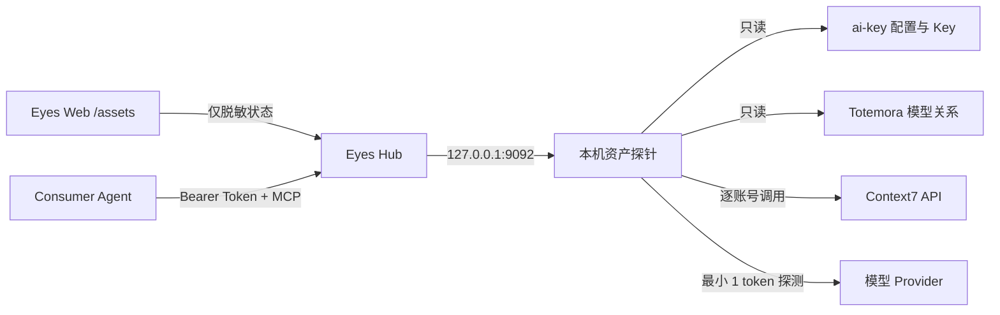

# 资产管理与 Agent 服务聚合

登录 Eyes 后进入 `/assets`，可以在一个页面里查看模型配置、模型连通性、Totemora 的使用关系和 Context7 账号状态。这个页面回答的是“Agent 现在有哪些外部能力可用”，不会展示任何 Key。

Context7 是可选能力。未配置账号时，页面会提示“尚未配置”，Hub、Fleet、域名管理和模型目录仍可正常使用。

## 页面怎么看

### 模型聚合

每一行代表一个 Provider / 模型组合：

- **可用**：最小探测请求成功。
- **未配置 Key**：发现了模型关系，但资产探针没有对应凭据。
- **鉴权失败**：Provider 拒绝当前凭据，需要检查 Key 或账号状态。
- **额度耗尽 / 频率受限**：配置存在，但暂时不能继续调用。
- **Provider 异常 / 不可达**：上游响应异常，或 Hub 无法建立连接。

页面首次加载或点击“刷新模型”时，会发送最大输出 1 token 的最小请求。探测结果缓存 5 分钟，不会保存或显示模型回答正文。

### Context7 服务聚合

每张卡片代表一个已配置账号，显示可用状态、上游返回的剩余额度、恢复时间和请求延迟。额度数据来自 Context7 API 响应头；上游没有返回时会显示“未知”，Eyes 不自行估算套餐总量。

“刷新额度”会触发一次真实上游探测，因此会消耗少量请求。服务端带有 60 秒防抖，连续点击不会无休止重复调用。

### Agent 统一入口

页面底部显示当前 Hub 的 MCP 地址和访问 Token 是否已启用。这里只显示状态，不显示 Token 内容。配置完成后，受信任 Agent 可以通过同一个地址调用 Context7 文档查询，不必逐个选择账号。

## 组件与信任边界



- Web 容器不挂载 Provider Key，也不接收 Context7 Key。
- `eyes-asset-probe` 只监听 `127.0.0.1:9092`，负责读取本机凭据、执行探测和账号池选择。
- Hub 从探针取得的模型状态和账号额度都不含 Key；数据库和页面不保存 Key。
- 对外的 Context7 MCP 入口为 `/mcp/context7`，必须使用独立的资产 API Token；推荐通过只读 Secret 文件挂载。
- 本机上能访问 loopback 的进程仍能调用资产探针，因此 Hub 宿主机本身属于受信任边界。

## 数据来源与探测规则

当前目录来源：

- `ai-key/providers.conf`：Provider、协议、Base URL 和模型。
- `ai-key/.env`：Provider Key，只由资产探针读取。
- Totemora `providers.yaml` 与 `agents.yaml`：模型和 Agent 使用关系。

相同模型信息会按来源合并：`ai-key` 是真实 Provider 配置来源，Totemora 用来补充哪些 Agent 正在使用该模型。`qwen` 会归一为 `dashscope`。只有模型 ID 完全一致时才复用 `ai-key` 的连接配置，不会把名字相似的模型猜测映射到其他端点。使用 `api_key_env` 的 Totemora-only Provider 可通过 `EYES_TOTEMORA_ENV_FILE_HOST` 指向的只读 env 文件向资产探针注入同名变量，否则页面显示“未配置 Key”。

## Context7 账号池

推荐把多个账号写入仓库外的 Secret 文件，每行一个账号：

```text
personal=ctx7sk_xxx
work=ctx7sk_yyy
```

然后在 Eyes `.env` 中只写不敏感的宿主机路径：`EYES_CONTEXT7_ACCOUNTS_FILE_HOST=./.eyes-secrets/context7-accounts`。原有 `EYES_CONTEXT7_ACCOUNTS=personal=...,work=...` 环境变量继续兼容，但会出现在容器环境元数据中，不作为生产首选。

每个标签和 Key 必须唯一。请求按账号轮询；遇到 `401`、`403` 或 `429` 时自动切换到下一个账号。额度重置后，账号会重新进入候选池。成功的相同文档查询缓存 6 小时，最多保存 128 项，以减少重复消耗。

页面显示 `RateLimit-Limit`、`RateLimit-Remaining` 和 `RateLimit-Reset` 响应头。Context7 官方文档说明这些头用于描述当前限额、剩余请求和 Unix 重置时间；429 只有 `Retry-After` 时，页面会据此显示预计恢复时间并在到期后恢复该账号。如果这些头均未返回，页面会明确显示“未知”，不会估算额度；服务内部仅做 60 秒防抖，随后重新尝试该账号。官方的完整月度/日度使用量目前只能在 Dashboard 查看：

- [Context7 API Guide](https://context7.com/docs/api-guide)
- [Context7 Usage Dashboard](https://context7.com/docs/howto/usage)

## 部署配置

默认 Compose 假设三个项目位于同一 `star` 目录布局：

```dotenv
EYES_AI_KEY_DIR_HOST=../ai-key
EYES_TOTEMORA_CONFIG_DIR_HOST=../../app/Totemora/configs/example
EYES_TOTEMORA_ENV_FILE_HOST=/path/to/totemora-provider.env
EYES_CONTEXT7_ACCOUNTS_FILE_HOST=./.eyes-secrets/context7-accounts
EYES_ASSET_API_TOKEN_FILE_HOST=./.eyes-secrets/asset-api-token
EYES_ASSET_MCP_RATE_LIMIT_PER_MINUTE=30
```

`context7-accounts` 使用上面的每行一账号格式；`asset-api-token` 只包含一行至少 24 位的独立随机 Token。两个文件都应设置为 `0600`，不得提交到仓库。目录不同的机器只需覆盖对应宿主机路径。启动后检查：

```bash
docker compose up -d --build
curl -fsS http://127.0.0.1:9092/api/health
```

不要把真实 Key 或 Token 写入仓库。`.env` 只保存 Secret 文件路径；后续可进一步切换为 Secret Manager。

首次配置完成后，建议按这个顺序验收：

1. 登录 `/assets`，确认模型和 Context7 页面都能加载。
2. 检查每个模型的状态是否符合实际账号情况。
3. 确认 Context7 卡片只显示标签和额度，不显示 Key。
4. 使用错误 Bearer Token 调用 MCP，确认返回 `401`。
5. 使用正确 Token 列出工具，再执行一次真实文档查询。

当前仓库没有附带真实 Context7 账号；真实账号验收需要部署者在本机填写 Secret 后完成。

## Agent 接入

MCP URL：

```text
http://<hub-ip>:<hub-port>/mcp/context7
```

客户端需发送：

```text
Authorization: Bearer <asset-api-token 文件内容>
```

MCP 暴露两个工具：

- `resolve-library-id`：调用 Context7 Library Search。
- `query-docs`：按 Library ID 查询最新文档片段。

当前入口同时支持两代无会话 Streamable HTTP：旧客户端可协商 `2025-03-26`，使用 `initialize`、`notifications/initialized`、`tools/list` 和 `tools/call`；现代客户端可使用 `2026-07-28`，通过 `server/discover` 或直接发送带请求级 `_meta` 的 `tools/list` / `tools/call`。现代请求必须同时携带匹配的 `MCP-Protocol-Version`、`Mcp-Method`，调用工具时还必须携带 `Mcp-Name`。服务端默认按来源 IP 限制为每分钟 30 次，并限制请求体、参数和上游响应大小；相同文档查询命中缓存时不消耗账号额度。带浏览器 `Origin` 的请求默认拒绝，确需 Web 客户端时通过 `EYES_ASSET_MCP_ALLOWED_ORIGINS` 显式列出来源。公网暴露前仍应在网关补 HTTPS 和访问审计。

## 当前限制

- 资产管理只做目录、连通性和 Context7 MCP 聚合，还不是通用模型代理网关。
- Model Provider 只探测当前配置的 OpenAI Chat/Responses 与 Anthropic Messages 兼容接口。
- Context7 没有公开的“读取所有套餐使用量且不消耗请求”的 API；额度卡片以实际 API 响应头为准。
- Context7 API Key 的服务条款和账号使用规则仍由操作者负责；账号池不绕过单账号限制，只在合法拥有的账号间做路由。
- 自动化测试已覆盖账号轮询、失败切换、额度恢复、缓存与 MCP 协议；真实账号的端到端结果仍取决于部署者的账号、套餐和上游服务状态。
