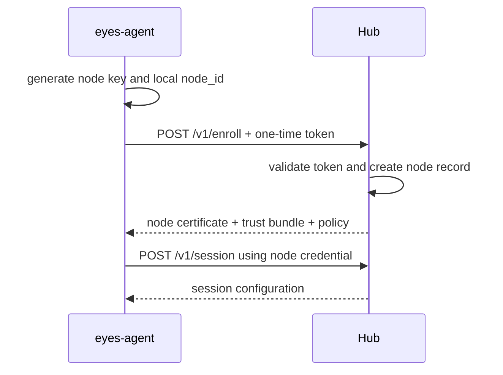

# Hub-Agent 协议

## 设计目标

- Agent 主动出站，适应 NAT、防火墙和动态地址。
- 节点身份不依赖 IP。
- 所有写操作可重试、幂等、带版本。
- 网络中断不会破坏本机业务或丢失活动 Lease 状态。
- 协议支持新旧 Agent 滚动共存。

## 传输选择

MVP 使用 HTTPS JSON：

- 部署和调试简单，能穿过常见反向代理。
- 心跳、快照和指标使用普通 POST/PUT。
- Hub 到 Agent 的任务通过长轮询返回，不要求节点监听端口。
- 请求体支持 gzip，时间统一使用 UTC RFC 3339。

需要更低延迟或更高吞吐时，可在不改变消息语义的前提下增加 WebSocket 或 gRPC 双向流。消息总线不作为初期依赖。

## 注册流程



注册 Token 必须单次使用、短时有效，并可限制预期标签、站点或信任域。Agent 私钥不离开节点。

当前第一阶段实现使用 `X-Eyes-Enroll-Token` 请求头传递共享 bootstrap Token。Agent 在首次请求前生成并持久保存节点专属 Bearer Token，Hub 只保存摘要；同一 `node_id + node_token` 的注册可以安全重放，避免响应丢失后节点永久无法注册。该机制用于打通协议，不等同于目标的一次性 Token/mTLS；生产安全升级状态见 [实现状态](implementation-status.md)。

## 核心端点

```text
POST /api/v1/enroll
POST /api/v1/node/session
POST /api/v1/node/heartbeat
PUT  /api/v1/node/inventory
PUT  /api/v1/node/resources
POST /api/v1/node/metrics:batch
GET  /api/v1/node/commands?cursor=<cursor>&wait=30
POST /api/v1/node/commands/<id>/ack
POST /api/v1/node/events:batch
POST /api/v1/node/leases/<id>/prepare
POST /api/v1/node/leases/<id>/renew
POST /api/v1/node/leases/<id>/result
POST /api/v1/node/maintenance/<id>/prepare
POST /api/v1/node/shell-sessions/<id>/attach
POST /api/v1/node/shell-sessions/<id>/close
```

节点身份来自客户端证书或会话凭据，不能接受请求体中的任意 `node_id` 作为授权依据。

## 心跳

```json
{
  "protocol_version": "eyes.node.v1",
  "agent_version": "0.2.0",
  "boot_id": "...",
  "sequence": 1842,
  "sent_at": "2026-07-20T12:00:00Z",
  "conditions": [
    {"type": "Ready", "status": true},
    {"type": "DiskPressure", "status": false}
  ],
  "active_lease_ids": ["lease_01..."]
}
```

建议心跳间隔约 30 秒。Hub 连续约三个窗口未收到心跳后标记 `stale`，而不是立即删除节点或回收仍可能运行的资源。

## 版本化快照

Inventory 和 ResourceSlice 使用 generation 与内容摘要：

- Agent 只在内容变化或定期校准时上传完整快照。
- Hub 以 `(node_id, kind, generation)` 幂等写入。
- 旧 generation 不得覆盖新状态。
- Hub 返回已接受 generation，Agent 可安全清理本地待发送记录。

## 命令模型

```json
{
  "command_id": "cmd_01...",
  "kind": "lease.prepare",
  "created_at": "2026-07-20T12:00:00Z",
  "expires_at": "2026-07-20T12:00:30Z",
  "idempotency_key": "claim_01...:generation:3",
  "payload": {},
  "signature": "..."
}
```

Agent 必须记录最近处理的命令 ID。重复命令返回相同结果，不重复启动任务。

## 维护与 ShellSession 协议

北向接口：

```text
POST /api/v1/nodes/<id>/maintenance-actions
POST /api/v1/nodes/<id>/shell-sessions
GET  /api/v1/shell-sessions/<id>
POST /api/v1/shell-sessions/<id>:close
```

创建 ShellSession 时 Hub 必须完成：

1. 校验 actor 的 `node.shell.open`、目标节点范围和所需 privilege。
2. 检查节点是否允许维护、是否处于敏感工作负载保护期。
3. 根据策略要求 reason、工单、二次确认或 approval。
4. 生成短期会话凭据、到期时间和唯一 session token。
5. 节点本地再次校验策略后创建受限 OS 用户会话或 PTY。
6. 保存连接、断开、提权、命令摘要或会话录制审计。

若使用 SSH，优先签发短期 SSH Certificate，并通过 overlay 网络直连节点；若使用 Agent PTY，数据帧必须绑定 session ID、严格排序、限流并端到端加密。两种传输共享同一个授权和审计模型。

## 断线与恢复

- 非关键高频指标可有界丢弃；Lease、任务状态和审计事件不能静默丢弃。
- 本地 SQLite/WAL 按优先级保存待发送记录，并设总容量上限。
- 重连后先恢复会话并对账活动 Lease，再补传资源快照和事件。
- Hub 比较 Agent 上报的活动 Lease 与控制面记录，生成 reconciliation 事件，不立即强杀未知任务。

## 北向工作负载 API

```text
GET  /api/v1/resources
POST /api/v1/placements:explain
POST /api/v1/workloads
GET  /api/v1/workloads/<id>
POST /api/v1/workloads/<id>:cancel
GET  /api/v1/workloads/<id>/artifacts
```

`placements:explain` 只做匹配解释，不预留资源，便于 AI Agent 在提交前了解可行节点和约束失败原因。

## 兼容规则

- URL 主版本只在破坏兼容时递增。
- 消息新增字段默认可忽略；删除或改变语义需要新主版本。
- Capability 自带独立版本，Hub 不能仅凭 Agent 版本推断能力。
- Hub 为每个命令声明最低 Agent/Capability 版本。
- Hub UI 显示版本漂移和即将失去支持的节点。
