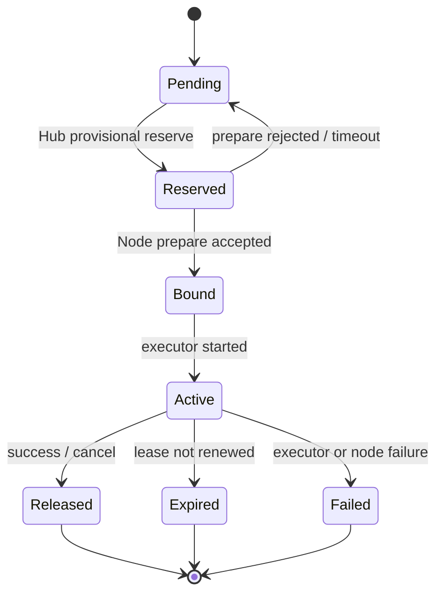

# 资源与调度模型

## 为什么不能只看 CPU 使用率

瞬时空闲率只能反映观测状态，不能防止两个 AI Agent 同时使用同一资源。Eyes 同时维护：

```text
physical_capacity
  - system_reserved
  - operator_reserved
= allocatable
  - active_leases
= unallocated
```

`observed_used` 用于评分、告警和保护，但不直接代替 `active_leases`。节点可根据真实负载收紧 `available_for_schedule`，但不能在没有 Lease 的情况下承诺资源。

## Node

节点身份不能依赖可变化或可能重复的 hostname。

```yaml
node_id: 01J...
display_name: gpu-workstation
roles: [gpu-worker]
labels:
  eyes.io/site: home
  eyes.io/zone: study
  eyes.io/trust-domain: private
status: ready
agent_version: 0.2.0
last_seen_at: 2026-07-20T12:00:00Z
```

角色和位置由所有者声明；硬件、运行时和动态资源由 Agent 探测。两类字段不能互相覆盖。

## Capability

Capability 描述“能提供什么功能”，采用带命名空间的稳定名称：

```yaml
- name: eyes.io/executor.container
  version: v1
  health: ready
  attributes:
    runtimes: [docker]
    architectures: [amd64]
- name: nvidia.com/cuda
  version: "12.8"
  health: ready
- name: local.ai/inference
  version: v1
  health: ready
  attributes:
    models: [qwen3, embedding-bge]
```

Capability 可以不可调度。例如 `systemd.read` 允许观察服务，但不代表允许远程重启服务。

节点可独立声明维护能力：

```yaml
- name: eyes.io/maintenance.shell
  version: v1
  health: ready
  attributes:
    transports: [ssh-cert, agent-pty]
    privilege_modes: [user, sudo-allowlist]
    recording: metadata
```

Capability 只表示节点支持该机制；具体 actor 是否能打开会话仍由 Hub RBAC、节点策略和当次会话条件共同决定。

## ResourceSlice

ResourceSlice 是节点对一组资源的版本化快照：

```yaml
resource_id: gpu-0
class: nvidia.com/gpu
share_mode: exclusive
capacity:
  count: 1
  memory_bytes: 25769803776
attributes:
  model: RTX-4090
  cuda_compute: "8.9"
health: ready
topology:
  node_id: 01J...
generation: 7
```

资源分为：

- 标准可分资源：CPU、内存、临时磁盘、带宽。
- 独占设备：整卡 GPU、USB 设备、采集卡。
- 可切分设备：GPU MIG、显存配额、共享带宽。
- 服务资源：推理 API、数据库、向量库；通常按并发或速率限额。
- 数据局部性资源：已缓存模型、数据集、NAS 路径和对象存储区域。

## Workload

Consumer Agent 提交声明式工作负载：

```yaml
apiVersion: eyes.io/v1alpha1
kind: Workload
metadata:
  name: summarize-batch-42
spec:
  type: batch
  selectors:
    eyes.io/trust-domain: private
  capabilities:
    - eyes.io/executor.container
  resources:
    requests:
      cpu_millis: 2000
      memory_bytes: 4294967296
      nvidia.com/gpu: 1
    limits:
      cpu_millis: 4000
      memory_bytes: 8589934592
  runtime:
    type: container
    image: registry.example/worker@sha256:...
    args: ["run", "/input/task.json"]
  placement:
    strategy: pack
    prefer_data:
      - model:qwen3
  timeout_seconds: 1800
  retry:
    max_attempts: 2
  output:
    artifact_policy: retain-7d
```

镜像应使用 digest 固定版本。`args` 只传给已批准的容器入口，不解释为宿主机 shell。

## ShellSession

ShellSession 不参与 CPU/GPU 工作负载调度，但会占用独立的维护并发配额：

```yaml
session_id: shell_01J...
actor_id: agent-or-user-id
node_id: 01J...
purpose: repair-nvidia-driver
mode: interactive
os_user: eyes-maint
privilege: sudo-allowlist
allowed_commands: [systemctl, journalctl, nvidia-smi]
issued_at: 2026-07-20T12:00:00Z
expires_at: 2026-07-20T12:30:00Z
idle_timeout_seconds: 300
approval_id: approval_01J...
recording: metadata
```

策略可以允许完整交互 shell、限制命令的非交互 shell，或只允许结构化 MaintenanceAction。资源调度授权与 ShellSession 授权必须分别授予。

## ResourceClaim 与 Lease

状态机：



Lease 至少包含：

- `lease_id` 和 `claim_id`。
- `node_id`、资源明细和工作负载摘要。
- `issued_at`、`expires_at`、续租间隔。
- 单调递增的 `fencing_token`。
- Hub 签名或可验证 MAC。

节点只执行当前 fencing token 的 Lease。旧 Hub 请求、网络重放或已超时任务不能恢复占用。

## 调度流水线

### QueueSort

MVP 按优先级和创建时间排序。后续加入用户/Agent 配额、历史用量公平性和等待时间提升。

### Filter

- 节点为 `ready`，心跳和资源快照未过期。
- 满足 capability、架构、运行时和标签约束。
- 资源请求不超过 allocatable 减活动 Lease。
- 信任域、网络策略和数据访问策略允许执行。
- 节点没有维护、过热、磁盘压力等 taint。

### Score

建议从简单可解释的加权评分开始：

```text
score = fit_density
      + data_locality
      + network_quality
      + cache_hit
      + reliability
      - fragmentation
      - energy_or_cost
```

- `batch` 默认倾向 `pack`，集中任务、释放其他节点并提高缓存命中。
- 长期 `service` 默认倾向 `spread`，降低单节点故障影响。
- GPU 任务优先减少显存碎片并匹配模型缓存。
- 评分明细写入调度事件，便于解释“为什么选择这台机器”。

### Reserve、Permit、Bind

1. Hub 创建短期临时 Reservation。
2. 节点重新检查真实资源、温度、磁盘和本地策略。
3. 节点返回 Prepared 或拒绝原因。
4. Hub 提交 Lease；节点收到相同 fencing token 后启动执行。
5. 任一步失败都回滚临时 Reservation。

## 队列、配额与抢占

MVP 只实现单队列、优先级和并发上限。后续按真实需求增加：

- 每个用户或 Consumer Agent 的资源配额。
- 项目队列之间共享未使用额度。
- 基于历史主导资源占用的公平排序。
- 只对明确标记为 `preemptible` 的任务执行抢占。

公平共享、队列借用和抢占可参考 [Kueue Fair Sharing](https://kueue.sigs.k8s.io/docs/concepts/fair_sharing/) 与 [Kueue Preemption](https://kueue.sigs.k8s.io/docs/concepts/preemption/)，但不在早期复制其复杂度。

## 多节点与复合资源

单节点放置是 MVP。分布式训练等场景需要多个资源 bundle 原子成功，否则全部不分配，即 gang scheduling。该能力应在单节点 Lease 稳定后实现，可借鉴 Ray Placement Group 的 PACK、SPREAD 和原子预留模型。
